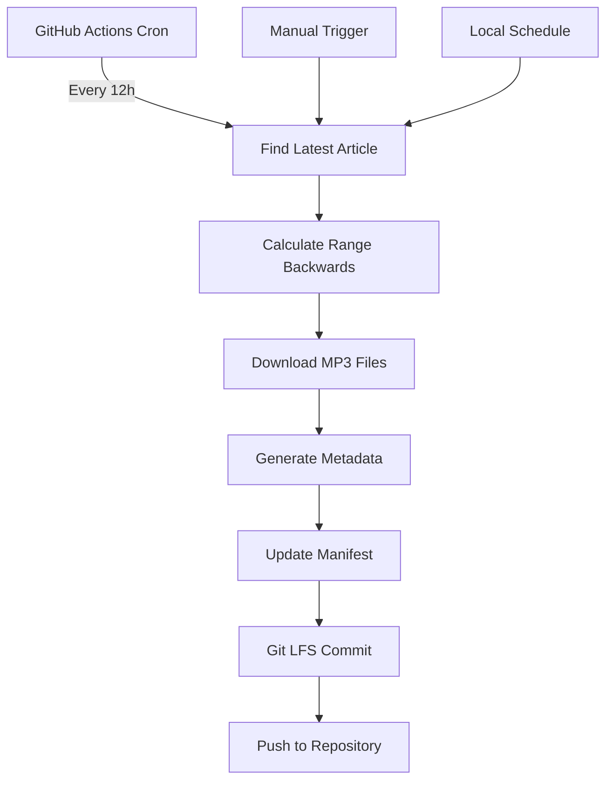

# Lingala Speech-to-Text Corpus (Lingala-STT)

A community-driven effort to create, curate, and openly publish a high-quality Lingala speech corpus for automatic speech recognition (ASR) research and products.

**🚀 Now with automated data collection!** GitHub Actions automatically downloads new Radio Okapi audio every 12 hours.

[](https://github.com/jnlandu/lingala-stt/actions)
[]()
[](LICENSE)

---

## 📁 Repository Structure

```
lingala-stt/
├── README.md                ← you are here
├── LICENSE                  ← CC-BY-4.0
├── .gitignore
├── requirements.txt         ← Python dependencies
├── data/
│   └── raw/
│       └── okapi/           ← automated Radio Okapi downloads
│           ├── *.mp3        ← daily audio bulletins
│           ├── metadata/    ← article info, dates, URLs
│           └── manifest.json ← dataset catalog
├── scripts/
│   ├── download_okapi.py    ← automated Radio Okapi scraper
│   ├── schedule_okapi.py    ← local scheduling script
│   ├── align_whisper.py     ← auto-transcribe + forced alignment
│   └── segment.py           ← silence-based segmentation
├── logs/                    ← scraper logs and download reports
├── .github/
│   └── workflows/
│       ├── radio_okapi.yml      ← 12h collection workflow
│       └── radio_okapi_daily.yml ← daily collection workflow
└── top-congo/               ← additional dataset sources
```

## 🎵 Audio Sources

### Automated Collection (Primary Source)
- **🤖 Radio Okapi**: Daily Lingala news bulletins automatically collected
  - Source: `https://www.radiookapi.net/journal-journal-lingala/`
  - Format: MP3, 1–15 min segments
  - Schedule: Every 12 hours (6 AM & 6 PM UTC)
  - Language: Professional Lingala news broadcasts from DRC
  - **Current Status**: Articles 1-6 collected, growing backwards from latest available

### Manual Collection Sources
- **Field recordings**: Spontaneous conversations from various DRC regions
- **Crowd recordings**: Short prompts read by volunteers
- **Public domain**: Freely available Lingala audio content

---

## 🚀 Quick Start

### Option 1: Use Pre-collected Data (Recommended)
```bash
# 1. Clone & install
git clone https://github.com/jnlandu/lingala-stt.git
cd lingala-stt
python -m venv .venv && source .venv/bin/activate  # or `.venv\Scripts\activate` on Windows
pip install -r requirements.txt

# 2. Check existing audio files (automatically collected)
ls data/raw/okapi/          # View downloaded MP3 files
cat data/raw/okapi/manifest.json | jq '.[] | {filename, title, date}'

# 3. Process existing audio
python scripts/segment.py data/raw/okapi/ \
                          --out_dir data/interim/okapi \
                          --batch_mode

# 4. Auto-align with Whisper
python scripts/align_whisper.py data/interim/okapi/

# 5. Export HF-ready dataset
python scripts/export_hf.py --repo jeremie/lingala-stt-dev
```

### Option 2: Download Fresh Audio
```bash
# Download latest 10 articles (working backwards from latest available)
python scripts/download_okapi.py \
  --latest 10 \
  --out data/raw/okapi \
  --metadata \
  --manifest

# Download specific article range
python scripts/download_okapi.py \
  --start 1 \
  --end 10 \
  --out data/raw/okapi \
  --metadata \
  --manifest \
  --incremental

# Test what's available
python scripts/download_okapi.py \
  --start 4 \
  --end 6 \
  --out data/test
```

---

## 🤖 Automated Data Collection

### GitHub Actions Workflows

**Two collection strategies:**

1. **`radio_okapi.yml`**: Forward-looking collection (5 AM UTC daily)
   - Downloads latest available articles
   - 20 articles per run

2. **`radio_okapi_daily.yml`**: Backward collection (6 AM & 6 PM UTC)
   - Auto-detects latest available article
   - Downloads 10 past articles per run
   - Safer approach, avoids 404 errors

### Current Collection Status
Based on your manifest, the system has successfully collected:
- **Articles 1-6**: January 2023 broadcasts
- **Recent files**: June 2025 broadcasts  
- **Total**: ~8 audio files (Growing automatically)

### Manual Trigger
Trigger collection manually via GitHub Actions:

1. Go to **Actions** tab in your repository
2. Select **"Radio Okapi Daily Lingala Scraper"** 
3. Click **"Run workflow"**
4. Configure parameters:
   - **Article count**: `10` (how many past articles)
   - **Start from**: Leave empty for auto-detection
   - **Force full scan**: `false`

### Local Scheduling
For continuous local collection:
```bash
# Run once
python scripts/schedule_okapi.py --once

# Run continuously (daily interval)
python scripts/schedule_okapi.py --interval daily

# Run with custom interval
python scripts/schedule_okapi.py --interval hourly
```

---

## 📊 Dataset Statistics

| Metric | Current Value | Auto-Updated |
|--------|---------------|--------------|
| **Total Audio Files** | 8+ files | Every 12h |
| **Article Range** | 1-6 (+ recent) | Growing |
| **Collection Period** | Jan 2023 - Jun 2025 | Continuous |
| **Language** | Lingala (ln) | - |
| **Source Quality** | Radio broadcast | Professional |
| **Average File Size** | ~2MB | Varies |

### Article URL Pattern
Radio Okapi follows predictable URLs:
```
https://www.radiookapi.net/journal-journal-lingala/journal-lingala-matin-{NUMBER}
```

**Strategy**: The system auto-detects the latest available article and works backwards to avoid 404 errors.

---

## 🔧 Development & Testing

### Local Testing
```bash
# Test scraper with small range
python scripts/download_okapi.py --start 4 --end 6 --out data/test

# Check logs
tail -f logs/okapi_auto_*.log

# Validate manifest
python -c "import json; print(len(json.load(open('data/raw/okapi/manifest.json'))))"
```

### Dependencies
```bash
pip install -r requirements.txt
```

Key packages:
- `requests` - HTTP requests
- `beautifulsoup4` - HTML parsing  
- `lxml` - XML/HTML processing

### Workflow Testing
Test GitHub Actions locally using [Act](https://github.com/nektos/act):
```bash
# Install act (macOS)
brew install act

# Test workflow locally
act workflow_dispatch -j scrape-okapi --input article_count=2
```

---

## 🤝 Contributing

### Data Contribution
1. **Automated**: GitHub Actions handles Radio Okapi collection
2. **Manual audio**: Add files to `data/raw/` with proper metadata
3. **Quality**: Use the manifest format for consistency

### Code Contribution
1. **Check issues** or open new ones
2. **Test locally** before submitting PRs
3. **Follow structure**: Add scripts to `scripts/`, workflows to `.github/workflows/`

### Collection Strategy
The current approach focuses on **historical articles** working backwards from the latest available, which ensures:
- ✅ No 404 errors
- ✅ Consistent collection
- ✅ Incremental growth
- ✅ Reliable automation

---

## 📜 License

```
Creative Commons Attribution 4.0 International
<https://creativecommons.org/licenses/by/4.0/>
```

**Automated collection** respects Radio Okapi's terms of service with:
- Rate limiting between requests
- Respectful crawling patterns
- Proper user agent identification

---

## 🔄 How Automation Works



### Process Flow:
1. **Auto-detection**: Finds latest available article (e.g., #192)
2. **Range calculation**: Downloads past N articles (e.g., 183-192)
3. **Incremental downloads**: Skips existing files
4. **Metadata extraction**: Parses titles, dates, URLs
5. **Git LFS storage**: Efficient handling of audio files
6. **Manifest updates**: JSON catalog for ML workflows

---

## 📈 Roadmap

| Phase | Target | Status |
|-------|--------|---------|
| **Q3 2024** | Automated collection setup | ✅ Complete |
| **Q4 2024** | 50+ articles collected | 🔄 In Progress |
| **Q1 2025** | Transcription pipeline | 📋 Planned |
| **Q2 2025** | First model release | 📋 Planned |

### Collection Projections
- **Daily**: ~20 articles (via 2x 10-article runs)
- **Weekly**: ~140 articles  
- **Monthly**: ~600 articles
- **Goal**: Build comprehensive historical archive

---

## 🔍 Troubleshooting

### Common Issues
```bash
# Check workflow status
cat .github/workflows/radio_okapi_daily.yml

# Verify downloads
ls -la data/raw/okapi/*.mp3

# Check logs for errors
grep -i error logs/okapi_auto_*.log

# Test single article
python scripts/download_okapi.py --start 5 --end 5 --out data/test
```

### 404 Errors
The new **backward collection strategy** eliminates 404 errors by:
1. Auto-detecting the latest available article
2. Working backwards from known good articles
3. Skipping gaps gracefully

### Storage Management
```bash
# Check Git LFS usage
git lfs ls-files

# Dataset size
du -sh data/raw/okapi/

# Clean up test files
rm -rf data/test/
```

---

## 📞 Support

- **Issues**: Use GitHub Issues for bug reports
- **Discussions**: GitHub Discussions for questions
- **Community**: Join Masakhane Discord `#lingala-asr`

---

*Maintained by @jeremie-nlandu and the Lingala-STT community.*  
*For automation questions, check the Actions tab or create an issue tagged `automation`.*

**🎯 Goal**: Build the largest open-source Lingala speech corpus for advancing ASR technology in Central Africa.