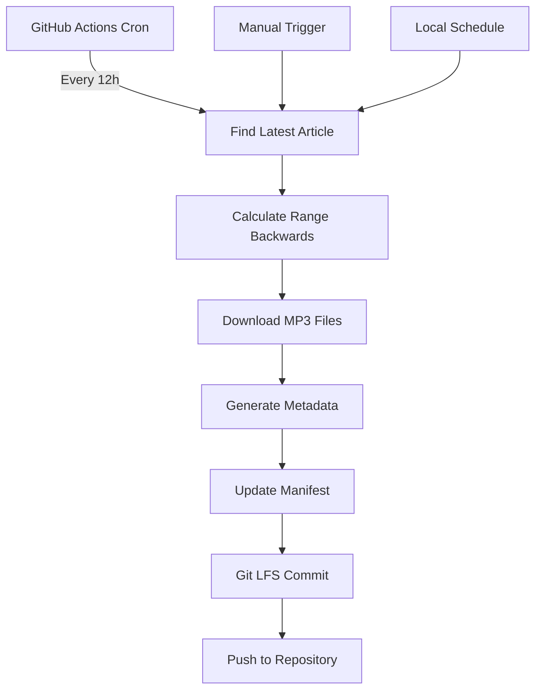

# Central African Languages Speech Corpus

An effort to create, curate, and openly publish a high-quality Lingala speech corpus for automatic speech recognition (ASR) research and products.

**Now with automated data collection!** GitHub Actions automatically downloads new Radio Okapi audio every 12 hours across multiple Congolese languages and stores them to Google Drive.

[](https://github.com/jnlandu/lingala-stt/actions)
[]()
[](LICENSE)

---

## Repository Structure

```
lingala-stt/
├── README.md                ← you are here
├── LICENSE                  ← CC-BY-4.0
├── .gitignore
├── requirements.txt         ← Python dependencies
├── data/
│   └── raw/
│       └── okapi/           ← automated Radio Okapi downloads
│           ├── lingala/     ← Lingala audio bulletins
│           │   ├── *.mp3
│           │   └── metadata/
│           ├── kikongo/     ← Kikongo audio bulletins
│           │   ├── *.mp3
│           │   └── metadata/
│           ├── tshiluba/    ← Tshiluba audio bulletins
│           │   ├── *.mp3
│           │   └── metadata/
│           └── manifest.json ← multi-language dataset catalog
├── scripts/
│   ├── download_okapi.py    ← automated Radio Okapi scraper (multi-language)
│   ├── schedule_okapi.py    ← local scheduling script
│   ├── align_whisper.py     ← auto-transcribe + forced alignment
│   └── segment.py           ← silence-based segmentation
├── logs/                    ← scraper logs and download reports
├── .github/
│   └── workflows/
│       ├── radio_okapi.yml      ← 12h collection workflow
│       └── radio_okapi_daily.yml ← daily collection workflow
└── top-congo/               ← additional dataset sources
```

## Audio Sources

### Automated Collection (Primary Source)
### Automated Collection (Primary Source)
- **🤖 Radio Okapi**: Daily news bulletins automatically collected in multiple languages and stored to Google Drive
  - **Lingala**: `https://www.radiookapi.net/journal-journal-lingala/`
  - **Kikongo**: `https://www.radiookapi.net/journal-journal-kikongo/`
  - **Tshiluba**: `https://www.radiookapi.net/journal-journal-tshiluba/`
  - Format: MP3, 1–15 min segments
  - Schedule: Every 12 hours (6 AM & 6 PM UTC)
  - Language: Professional broadcasts from DRC
  - **Storage**: Automatically synced to Google Drive
  - **Current Status**: Articles 1-6 collected per language, growing backwards from latest available

### Manual Collection Sources
- **Field recordings**: Spontaneous conversations from various DRC regions
- **Crowd recordings**: Short prompts read by volunteers
- **Public domain**: Freely available Lingala audio content

---

## Quick Start
### Option 1: Use Pre-collected Data (Recommended)
```bash
# 1. Clone & install
git clone https://github.com/jnlandu/lingala-stt.git
cd lingala-stt
python -m venv .venv && source .venv/bin/activate  # or `.venv\Scripts\activate` on Windows
pip install -r requirements.txt

# 2. Check existing audio files (automatically collected and stored to Google Drive)
ls data/raw/okapi/lingala/   # View Lingala MP3 files
ls data/raw/okapi/kikongo/   # View Kikongo MP3 files
ls data/raw/okapi/tshiluba/  # View Tshiluba MP3 files
cat data/raw/okapi/manifest.json | jq '.[] | {filename, title, date, language}'

# 3. Process existing audio (specify language)
python scripts/segment.py data/raw/okapi/lingala/ \
                          --out_dir data/interim/okapi/lingala \
                          --batch_mode
```

### Option 2: Download Fresh Audio
```bash
# Download latest 10 articles for all languages
python scripts/download_okapi.py \
  --latest 10 \
  --out data/raw/okapi \
  --metadata \
  --manifest \
  --languages lingala,kikongo,tshiluba

# Download specific article range for Lingala only
python scripts/download_okapi.py \
  --start 1 \
  --end 10 \
  --out data/raw/okapi \
  --metadata \
  --manifest \
  --incremental \
  --languages lingala

# Test what's available across languages
python scripts/download_okapi.py \
  --start 4 \
  --end 6 \
  --out data/test \
  --languages lingala,kikongo,tshiluba
```

---


## Automated Data Collection

### GitHub Actions Workflows

**Two collection strategies with automatic Google Drive storage:**

1. **`radio_okapi.yml`**: Forward-looking collection (5 AM UTC daily)
   - Downloads latest available articles across all languages
   - 20 articles per run per language
   - Automatically syncs to Google Drive

2. **`radio_okapi_daily.yml`**: Backward collection (6 AM & 6 PM UTC)
   - Auto-detects latest available article per language
   - Downloads 10 past articles per run per language
   - Safer approach, avoids 404 errors
   - Automatically syncs to Google Drive

### Current Collection Status
The system has successfully collected and stored to Google Drive:
- **Lingala Articles 1-6**: January 2023 broadcasts
- **Kikongo Articles 1-6**: January 2023 broadcasts  
- **Tshiluba Articles 1-6**: January 2023 broadcasts
- **Recent files**: June 2025 broadcasts across all languages
- **Total**: ~24 audio files (Growing automatically)

### Manual Trigger
Trigger collection manually via GitHub Actions:

1. Go to **Actions** tab in the repository
2. Select **"Radio Okapi Daily Multi-Language Scraper"** 
3. Click **"Run workflow"**
4. Configure parameters:
   - **Article count**: `10` (how many past articles per language)
   - **Languages**: `lingala,kikongo,tshiluba` (comma-separated)
   - **Start from**: Leave empty for auto-detection
   - **Force full scan**: `false`

### Local Scheduling
For continuous local collection:
```bash
# Run once for all languages
python scripts/schedule_okapi.py --once --languages lingala,kikongo,tshiluba

# Run continuously (daily interval)
python scripts/schedule_okapi.py --interval daily --languages lingala,kikongo,tshiluba

# Run with custom interval
python scripts/schedule_okapi.py --interval hourly --languages lingala,kikongo,tshiluba
```
---

##  Dataset Statistics

| Metric | Current Value | Auto-Updated |
|--------|---------------|--------------|
| **Total Audio Files** | 24+ files | Every 12h |
| **Languages** | Lingala, Kikongo, Tshiluba | - |
| **Article Range** | 1-6 per language (+ recent) | Growing |
| **Collection Period** | Jan 2023 - Jun 2025 | Continuous |
| **Source Quality** | Radio broadcast | Professional |
| **Average File Size** | ~2MB | Varies |
| **Storage** | Google Drive | Automated |

### Article URL Patterns
Radio Okapi follows predictable URLs per language:
```
https://www.radiookapi.net/journal-journal-lingala/journal-lingala-matin-{NUMBER}
https://www.radiookapi.net/journal-journal-kikongo/journal-kikongo-matin-{NUMBER}
https://www.radiookapi.net/journal-journal-tshiluba/journal-tshiluba-matin-{NUMBER}
```
**Strategy**: The system auto-detects the latest available article per language and works backwards to avoid 404 errors, with automatic storage to Google Drive.

---

## Development & Testing

### Local Testing
```bash
# Test scraper with small range for specific language
python scripts/download_okapi.py --start 4 --end 6 --out data/test --languages lingala

# Test all languages
python scripts/download_okapi.py --start 4 --end 6 --out data/test --languages lingala,kikongo,tshiluba

# Check logs
tail -f logs/okapi_auto_*.log

# Validate manifest
python -c "import json; print(len(json.load(open('data/raw/okapi/manifest.json'))))"
```

### Dependencies
```bash
pip install -r requirements.txt
```

Key packages:
- `requests` - HTTP requests
- `beautifulsoup4` - HTML parsing  
- `lxml` - XML/HTML processing

### Workflow Testing
Test GitHub Actions locally using [Act](https://github.com/nektos/act):
```bash
# Install act (macOS)
brew install act

# Test workflow locally
act workflow_dispatch -j scrape-okapi --input article_count=2
```
If you have github installed, you can run the workflow with:

```bash
gh workflow run radio_okapi_daily.yml --field article_count=2 --field languages=lingala,kikongo,tshiluba
```
---

## Contributing

### Data Contribution
1. **Automated**: GitHub Actions handles Radio Okapi collection
2. **Manual audio**: Add files to `data/raw/` with proper metadata
3. **Quality**: Use the manifest format for consistency

### Code Contribution
1. **Check issues** or open new ones
2. **Test locally** before submitting PRs
3. **Follow structure**: Add scripts to `scripts/`, workflows to `.github/workflows/`

### Collection Strategy
The current approach focuses on **historical articles** working backwards from the latest available, which ensures:
- ✅ No 404 errors
- ✅ Consistent collection
- ✅ Incremental growth
- ✅ Reliable automation


### Next Steps
- Implement transcription pipeline
- Add more languages (e.g., Kikongo dialects )
---

## License

```
Creative Commons Attribution 4.0 International
<https://creativecommons.org/licenses/by/4.0/>
```

## 🔄 How Automation Works



### Process Flow:
1. **Auto-detection**: Finds latest available article (e.g., #192)
2. **Range calculation**: Downloads past N articles (e.g., 183-192)
3. **Incremental downloads**: Skips existing files
4. **Metadata extraction**: Parses titles, dates, URLs
5. **Git LFS storage**: Efficient handling of audio files
6. **Manifest updates**: JSON catalog for ML workflows

---

## 📈 Roadmap

| Phase | Target | Status |
|-------|--------|---------|
| **Q2 2025** | Automated collection setup | In progress |
| **Q3 2025** | 50+ articles collected | 🔄 In Progress |
| **Q4 2025** | Transcription pipeline | 📋 Planned |
| **Q1 2026** | First model release | 📋 Planned |

### Collection Projections
- **Daily**: ~2 articles (via 2x 10-article runs)
- **Weekly**: ~14 articles  
- **Monthly**: ~56 articles
- **Goal**: Build comprehensive historical archive

---

### 404 Errors
The new **backward collection strategy** eliminates 404 errors by:
1. Auto-detecting the latest available article
2. Working backwards from known good articles
3. Skipping gaps gracefully

### Storage Management
```bash
# Check Git LFS usage
git lfs ls-files

# Dataset size
du -sh data/raw/okapi/
```


---

## Support
- **Issues**: Use GitHub Issues for bug reports
- **Discussions**: GitHub Discussions for questions
- **Contributions**: PRs welcome, see [CONTRIBUTING.md](CONTRIBUTING.md)
---

*Maintained by @jnlandu.*  
*For automation questions, check the Actions tab or create an issue tagged `automation`.*

** Goal**: Build the largest open-source Lingala speech corpus for advancing ASR technology in Central Africa.